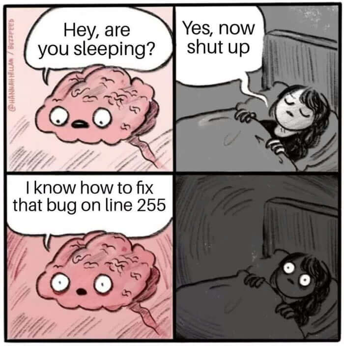
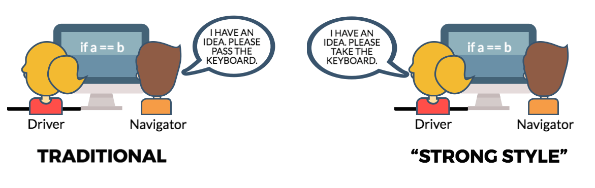
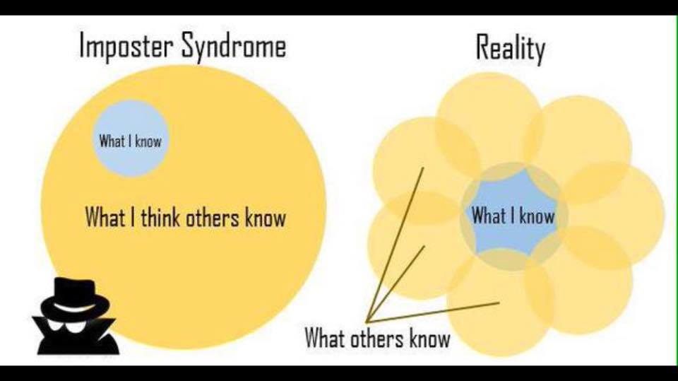

import { Head } from 'mdx-deck'
import { Appear } from 'mdx-deck'
import { Split } from 'mdx-deck/layouts'
import BlackLayout from './components/blackLayout'
import { Intro } from './components/daniela/intro'
import { Before } from './components/daniela/before'
import { Today } from './components/daniela/today'

export default BlackLayout

<Head>
  <title>Front End Adventures - UND</title>
</Head>

<Intro />

---
export default BlackLayout

<Before />

---
export default BlackLayout

<Today />

---
export default Split

## CODING BOOTCAMP "trust the process"

---
export default BlackLayout

## aprender a aprender

---
export default BlackLayout

## pair programming

---
export default BlackLayout

## unconscious bias

<iframe width="560" height="315" src="https://www.youtube.com/embed/pJvJo1mxVAE" frameborder="0" allow="accelerometer; autoplay; encrypted-media; gyroscope; picture-in-picture" allowfullscreen></iframe>

---

https://implicit.harvard.edu/

---

export default BlackLayout

## impostor syndrome

---

---
export default BlackLayout

## de retro

---
export default BlackLayout

## gracias
...a por ello!
