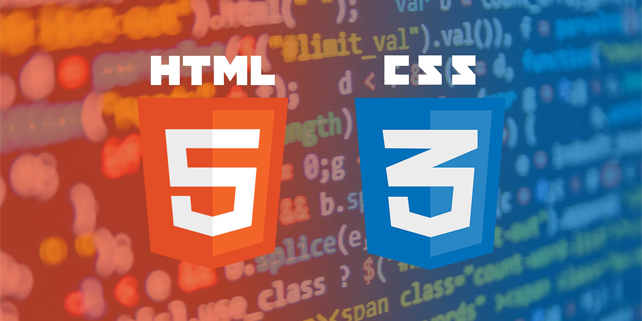
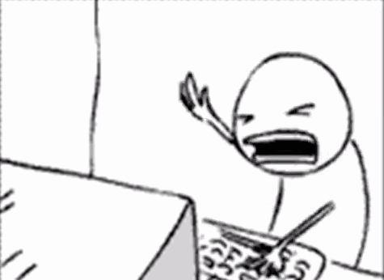

import { Head } from 'mdx-deck'
import styled from 'styled-components'
import { About } from './components/kathia/about.js'
import { Today } from './components/kathia/today.js'
export { default as theme } from './theme'

# Kathia Neira
<About/>

---

## ¿Por qué frontend?


```notes
- Create speaker notes in fenced code blocks
```

---

## Mis inicios


---

## Actualmente
<Today/>

---

## ¿Todo es perfecto?


---

## ¿Entonces, por qué sigo en este mundo?


---

## Gracias :)
